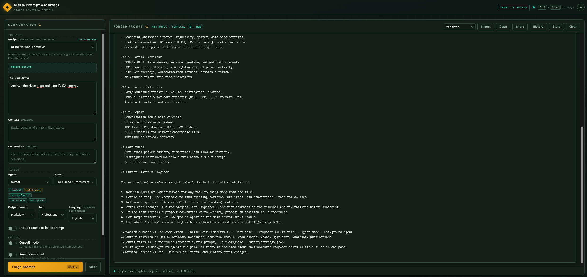

<p align="center">
  
</p>

<h1 align="center">Meta-Prompt Architect</h1>

<p align="center">
  <em>Platform-aware prompt engineering workbench for AI coding agents.</em>
</p>

<p align="center">
  
  
  
  
  
</p>

<p align="center">
  <a href="#quick-start">Quick Start</a> •
  <a href="#features">Features</a> •
  <a href="#one-shot-recipes">Recipes</a> •
  <a href="#cli-reference">CLI</a> •
  <a href="#web-ui">Web UI</a> •
  <a href="#configuration">Config</a>
</p>

---

Generate platform-aware, context-grounded prompts for **Cursor**, **Claude Code**, **OpenCode**, **DeepSeek**, **Kimi**, **GPT**, **Windsurf**, **Cline/Roo Code**, and generic agents. Every prompt includes a Platform Playbook that tells the agent how to exploit its own capabilities.



## Features

| | |
|---|---|
| **Platform Playbooks** | Agent-specific instructions exploiting each platform's modes, context features, multi-agent support, and terminal access |
| **Project Grounding** | Template mode auto-scans your project and injects real facts — stack, structure, git branch, and detected verify commands — into every prompt, so output is never generic (skip with `--no-project`) |
| **Execution Loop** | Every prompt enforces a modern agentic loop: PLAN → ACT → VERIFY (with your project's real commands) → ITERATE → REPORT with evidence |
| **Ship Plan & Test Matrix** | Build-oriented prompts get stack-aware ship steps (Tauri, .NET, Node, Python/ML, Rust, Go, Docker, Vagrant) plus a mandatory unit/integration/e2e/CI matrix |
| **Safety & Honest Gates** | Security prompts carry intent-level-tools + HITL + scope-policy + audit-ledger clauses and compliance mapping (ATT&CK/ATLAS/OWASP LLM 10/NIST AI 600-1); every prompt enforces honest quality gates |
| **Repo Scaffold** | `--scaffold` writes a stack-aware skeleton (GitHub Actions CI, Makefile, `.env.example`) for the detected stack |
| **121 One-Shot Recipes** | Proven mega-prompts across software build, cybersecurity, DFIR, reverse engineering, malware analysis, AI security, red team, blue team, cloud, appsec, OSINT, cryptography, AI/agentic frameworks — plus 10 project blueprints for building, testing, and deploying complete tools and labs |
| **Consult Mode** | LLM-authored prompts grounded in your actual project files via structured meta-prompt; `--stream` for token-by-token output |
| **Consult Refine Loop** | After drafting, the prompt is scored against a 6-dimension rubric and revised once when it scores below threshold — generation *and* quality check in one guided request |
| **Task Granularity** | `auto`/`micro`/`task`/`mega` — micro = single goal, lean, no boilerplate; task = full template; mega = recipe contract. Auto picks by task size |
| **Lean Mode** | `--lean` strips ship/test/safety/compliance/honest-gate sections — just Goal, Context, Grounding, Loop. Goal-first structure by default |
| **Quality Scoring** | 6-dimension rubric (specificity, structure, constraints, platform utilization, completeness, actionability) via `--score`, in the web UI header, and in `--json` |
| **Prompt Testing** | `--test` runs the prompt against an LLM and evaluates the response — format compliance, `--expect` criteria, LLM-as-judge scores |
| **Custom Recipe Builder** | Define reusable prompt patterns with custom placeholders via `--create-recipe` or the web UI wizard; saved to `.mpa/recipes/` and validated on load |
| **Prompt Chaining** | `--chain id1,id2,...` links recipes into pipelines with handoff instructions, context carryover, and quality gates per step |
| **Recipe Packs** | Share recipes as portable JSON packs — `--export-pack <category>` / `--import-recipe <url|file|gist>`; `--share-pack` publishes to a GitHub Gist |
| **Review Workflow** | `--review` opens the prompt in `$EDITOR` for edit + approval before it is exported, piped, or saved to history |
| **Analytics** | Local usage tracking with `--analytics` summary and a web UI dashboard (top agents/recipes, quality trend, test pass rate) |
| **Plugin System** | Extend with custom exporters, platforms, enhancers, and scanners via `.mpa/plugins/` manifests |
| **Templatize** | `--templatize <file>` reverse-engineers an existing prompt into a reusable recipe (LLM or offline heuristic) |
| **Config Profiles** | `--save-profile` / `--profile` save and reuse generation configs (secrets never persisted) |
| **Multi-Language** | `--lang es|ja|zh` translates template scaffolding while keeping user content and technical terms intact |
| **Batch Generation** | Platform-tailored prompts for multiple agents in one command |
| **Prompt History** | Local auto-save with search, replay, and clear |
| **History-as-Memory** | Consult mode retrieves similar past prompts (preferring human-edited ones) as few-shot context — the Architect reuses what already worked |
| **Version Diff** | `--history-diff id1 id2` diffs two prompts and shows which config changes produced the output changes; side-by-side view in the web UI History modal |
| **Direct Piping** | Send prompts straight to Cursor, Claude Code, OpenCode, Aider, Windsurf, Continue, Cody, or Copilot |
| **Web UI** | Full-viewport drafting console with dark/light themes, shareable URLs, Ctrl+Enter |
| **10 Export Formats** | `.cursorrules`, `.clinerules`, `AGENTS.md`, `.windsurfrules`, OpenCode JSON, VS Code Snippets, Custom GPT, and more |

## Quick Start

```bash
git clone https://github.com/Ganron007/Meta-Prompt-Architect.git
cd Meta-Prompt-Architect
npm install
```

```bash
# Generate a prompt
node src/cli.js --agent cursor --domain security --task "Review API key handling"

# Use a one-shot recipe
node src/cli.js --recipe one-shot-game --agent cursor --task "tower defense game"

# LLM consult mode (needs an OpenAI-compatible endpoint — see Configuration)
node src/cli.js --consult --agent claude --task "harden my RAG API" --project .

# Batch: multiple agents at once
node src/cli.js --agents cursor,claude,deepseek --task "Review auth module"

# Export to .cursorrules
node src/cli.js --agent cursor --task "Review auth" --export cursorrules --out ./

# Share a recipe pack with your team via Gist
node src/cli.js --share-pack dfir

# Team library: commit .mpa/recipes/ to your repo — everyone gets the recipes

# Pipe directly to Claude Code
node src/cli.js --pipe claude --agent claude --task "Refactor the API layer"

# Web UI
node src/cli.js --serve

# Validate the bundled recipe catalog
node src/cli.js --validate-recipes
```

## One-Shot Recipes

121 proven patterns across 17 categories. List them with `--recipes`:

| Category | Count | Examples |
|---|---|---|
| **Software Build** | 8 | `readme-driven`, `one-shot-game`, `fullstack-app`, `prd-then-build`, `saas-starter`, `clone-builder` |
| **Cybersecurity** | 18 | `pentest-report`, `threat-model`, `malware-analysis`, `red-team-plan`, `exploit-dev`, `forensic-analysis` |
| **Security Research** | 4 | `sec-research-solve`, `sec-research-build`, `sec-research-hunt`, `sec-research-validate` |
| **DFIR** | 8 | `dfir-disk-forensics`, `dfir-memory-forensics`, `dfir-network-forensics`, `dfir-timeline-analysis`, `dfir-log-analysis` |
| **Reverse Engineering** | 8 | `re-static-analysis`, `re-dynamic-analysis`, `re-protocol-analysis`, `re-firmware-analysis`, `re-unpacking-deobfuscation` |
| **Malware Analysis** | 8 | `mal-static-triage`, `mal-dynamic-sandbox`, `mal-behavioral-analysis`, `mal-c2-protocol-analysis`, `mal-yara-rule-writing` |
| **AI / ML Security** | 8 | `aisec-prompt-injection`, `aisec-adversarial-ml`, `aisec-llm-red-team`, `aisec-ai-supply-chain`, `aisec-ai-agent-security` |
| **Red Team Operations** | 8 | `rt-initial-access`, `rt-persistence`, `rt-privilege-escalation`, `rt-lateral-movement`, `rt-c2-operations` |
| **Blue Team / Detection** | 6 | `blue-siem-rules`, `blue-threat-hunt`, `blue-alert-triage`, `blue-detection-pipeline`, `blue-purple-team` |
| **Cloud Security** | 5 | `cloud-aws-audit`, `cloud-azure-audit`, `cloud-k8s-security`, `cloud-container-security`, `cloud-iam-review` |
| **Application Security** | 4 | `appsec-api-security`, `appsec-mobile-security`, `appsec-sast-dast`, `appsec-secure-sdlc` |
| **OSINT / Threat Intel** | 4 | `osint-collection`, `osint-actor-profiling`, `osint-ioc-management`, `osint-intel-report` |
| **Cryptography** | 3 | `crypto-implementation-review`, `crypto-protocol-analysis`, `crypto-pqc-migration` |
| **AI / Agentic** | 10 | `langgraph-agent`, `langchain-rag`, `crewai-crew`, `autogen-team`, `mcp-server`, `ai-eval-suite` |
| **AI × Cybersecurity** | 6 | `ai-soc-analyst`, `ai-threat-hunter`, `ai-pentest-crew`, `ai-code-security`, `ai-incident-responder` |
| **AI × Operations** | 3 | `ai-research-crew`, `ai-devops-agent`, `ai-data-pipeline` |
| **Project Blueprints** | 10 | `tauri-desktop-app`, `avalonia-desktop-app`, `llm-finetune-study`, `ad-soc-lab`, `c2-training-range`, `mcp-sec-tool`, `ai-audit-cli`, `re-stage-pipeline`, `grc-risk-pipeline`, `vuln-ai-lab` |

The **Security Research** recipes implement a full 8-phase-gate methodology (G0–G7) with evidence ledgers, adversarial audit, multi-agent policy, and mode-specific contracts.

## CLI Reference

<details>
<summary><strong>Full option table</strong></summary>

| Option | Description |
|---|---|
| `--agent` | `cursor`, `deepseek`, `kimi`, `claude`, `gpt`, `windsurf`, `cline`, `opencode`, `generic` |
| `--agents` | Comma-separated list for batch generation |
| `--domain` | `lab-build`, `code-review`, `security`, `feature-exploration`, `release-readiness`, `general` |
| `--task` | Task description (required) |
| `--context` | Additional background |
| `--constraints` | Rules to enforce |
| `--project` | Project directory to scan (default: cwd); `--no-project` skips scanning |
| `--format` | `markdown`, `json`, `table`, `code`, `diagram`, `text` |
| `--tone` | `professional`, `casual`, `strict` |
| `--lang` | Template scaffolding language: `en`, `es`, `ja`, `zh` |
| `--examples` | Include examples in the prompt |
| `--rewrite` | Polish raw input via rules or LLM |
| `--consult` | LLM authors the prompt with project grounding (`--stream` for live tokens) |
| `--no-memory` | Disable history-as-memory few-shot in consult mode |
| `--no-refine` | Disable the score-gated revision loop in consult mode |
| `--granularity` | `auto` (default) \| `micro` \| `task` \| `mega` — controls prompt scope |
| `--lean` | Strip optional sections — straight goal/task prompt with no boilerplate |
| `--scan` | Print the scanned project context and exit |
| `--scaffold` | Write a stack-aware repo skeleton (CI workflow, Makefile, `.env.example`) to `--out/scaffold` |
| `--recipe` | Use a one-shot recipe |
| `--chain` | Link recipes into a chain with handoffs and quality gates: `--chain id1,id2,...` or a preset (`@blueprint-sec`, `@blueprint-ai`) |
| `--recipes` | List all recipes |
| `--model` | LLM model name (or `OPENAI_MODEL`) |
| `--api-key` | API key (or `OPENAI_API_KEY`) |
| `--api-base` | OpenAI-compatible base URL (or `OPENAI_BASE_URL`) |
| `--reasoning` | Reasoning effort for reasoning models: `low`, `medium`, `high` |
| `--export` | `cursorrules`, `clinerules`, `agents-md`, `windsurfrules`, `opencode`, `opencode-jsonc`, `vscode`, `custom-gpt`, `antigravity`, `markdown` |
| `--name` / `--out` | Output file name and directory (default: `./out`) |
| `--pipe` | Send to agent: `cursor`, `claude`, `opencode`, `aider`, `windsurf`, `continue`, `cody`, `copilot` |
| `--history` | List prompt history; `--history-get <id>`, `--history-replay <id>`, `--history-clear` |
| `--history-diff` | Diff two history prompts and their configs: `--history-diff id1 id2` |
| `--score` | Score the generated prompt against a 6-dimension quality rubric |
| `--test` | Run the prompt against an LLM and evaluate the response (`--expect csv`, `--no-judge`, `--show-response`) |
| `--validate-recipes` | Validate recipe fields, categories, and placeholders |
| `--create-recipe` | Build + save a custom recipe (use `--recipe-name/-category/-role/-steps/-rules/-output/-placeholders`) |
| `--recipe-scope` | Save custom recipes to `project` (`.mpa/recipes/`) or `user` (`~/.mpa/recipes/`) |
| `--recipe-dir` | Explicit custom recipe directory (load or save); `--overwrite-recipe` replaces existing |
| `--import-recipe` | Import a recipe pack from a file, URL, or GitHub Gist |
| `--export-pack` | Export a category (or `all`) as a shareable recipe pack JSON |
| `--share-pack` | Publish a recipe pack to a GitHub Gist (needs `GITHUB_TOKEN`) |
| `--review` | Edit + approve the prompt in `$EDITOR` before export/pipe/history |
| `--vars` | JSON object with values for a custom recipe's extra placeholders |
| `--json` | Machine-readable output |
| `--analytics` | Usage analytics summary (top agents, recipes, quality trend) |
| `--plugins` | List loaded plugins (from `.mpa/plugins/` / `~/.mpa/plugins/`; `--plugin-dir` overrides) |
| `--enhance-with` | Apply plugin enhancers to inputs: `--enhance-with id1,id2` |
| `--scanner` | Use a plugin scanner for project context (also in `--consult`) |
| `--templatize` | Reverse-engineer a prompt file into a recipe (`-` reads stdin; `--offline` for heuristics) |
| `--profile` | Load a saved config profile (explicit CLI flags override it) |
| `--save-profile` | Save current config as a profile; `--profiles` lists all saved; `--profile-dir` overrides |
| `--serve` | Start web UI |

</details>

## Web UI

```bash
npm start    # http://localhost:3000
```

Full-viewport drafting console. Binds to `127.0.0.1` (set `HOST`/`PORT` to override).

- Recipe dropdown with category grouping and task hints
- Platform capability chips on agent selection
- Custom recipe builder wizard (saves to `.mpa/recipes/`)
- Quality score chip (grade + per-dimension tooltip) on every forged prompt
- Streaming toggle for consult mode (token-by-token output)
- History modal with two-version side-by-side diff
- Stats dashboard (top agents/recipes, quality trend, test pass rate)
- Dark/light theme toggle (persisted)
- Ctrl+Enter to forge, Share button for URL-encoded configs
- Live status strip with word count and engine badge

## Configuration

```bash
cp .env.example .env
```

One generic OpenAI-compatible configuration drives every LLM feature
(`--consult`, `--rewrite`, `--test`, `--templatize`). No provider labels, no
hardcoded model names — point it at **any** OpenAI-compatible endpoint
(OpenAI, DeepSeek, MiMo, Groq, vLLM, LM Studio, Ollama, ...):

| Setting | Env Var | Notes |
|---|---|---|
| API key | `OPENAI_API_KEY` | Blank is fine for keyless local servers |
| Base URL | `OPENAI_BASE_URL` | Default `https://api.openai.com/v1`; e.g. `http://localhost:11434/v1` for Ollama |
| Model | `OPENAI_MODEL` | Required for LLM features — whatever your endpoint serves |
| Reasoning effort | `OPENAI_REASONING` | Optional `low` / `medium` / `high` for reasoning models |
| Fallback model | `OPENAI_FALLBACK_MODEL` | Optional retry model if the primary call fails |
| GitHub | `GITHUB_TOKEN` | Only for `--share-pack` / Gist recipe imports |

## Project Structure

```
src/
├── cli.js           # CLI orchestration
├── config.js        # Env loading & generic LLM resolution
├── server.js        # Express web UI
├── generator.js     # Template prompt construction
├── architect.js     # LLM consult mode
├── context.js       # Project scanner
├── platforms.js     # Platform playbooks (9 agents)
├── recipes.js       # 121 one-shot recipes + blueprints
├── custom-recipes.js # Custom recipe builder (build/validate/save/load)
├── chain.js         # Prompt chain handoffs + quality gates
├── recipe-packs.js  # Recipe pack import/export (file, URL, Gist)
├── diff.js          # Line diff + config-change detection
├── i18n.js          # Template scaffolding translations (en/es/ja/zh)
├── scorer.js        # Prompt quality rubric scorer
├── prompt-test.js   # LLM response evaluator + judge
├── gist.js          # Publish recipe packs to GitHub Gist
├── review.js        # $EDITOR review + approval gate
├── analytics.js     # Local usage analytics + summary
├── plugins.js       # Plugin loader (exporters/platforms/enhancers/scanners)
├── templatize.js    # Reverse-engineer prompts into recipes
├── profiles.js      # Saved config profiles
├── history.js       # Prompt history store
├── piping.js        # Agent piping (8 targets)
├── llm.js           # OpenAI-compatible LLM client (call + stream)
├── enhancer.js      # Input polishing
├── templates.js     # Agent/domain profiles
└── exporters.js     # 10 export formatters

public/
├── index.html       # Web UI shell
├── app.js           # Web UI logic (forge, stream, history/diff, stats)
└── style.css        # Web UI theme
```

## Research Foundations

Synthesizes patterns from: LangGPT · Prompt Engineering Guide (dair-ai) · prompts.chat · Promptfoo · Microsoft Promptbase · GPTs leaked prompts

## Documentation

- [docs/usage-guide.md](docs/usage-guide.md) — task-oriented walkthrough of every feature with examples
- [docs/recipe-authoring.md](docs/recipe-authoring.md) — how to write, validate, and share recipes
- [docs/platform-authoring.md](docs/platform-authoring.md) — how to add platforms and playbooks
- [docs/api.md](docs/api.md) — HTTP API reference for the web server
- [docs/maintenance.md](docs/maintenance.md) — freshness surfaces, update procedures, release checklist

---

<p align="center">
  <sub>Built for solo engineers running multi-faceted operations.</sub>
</p>

## License

[MIT](LICENSE)
